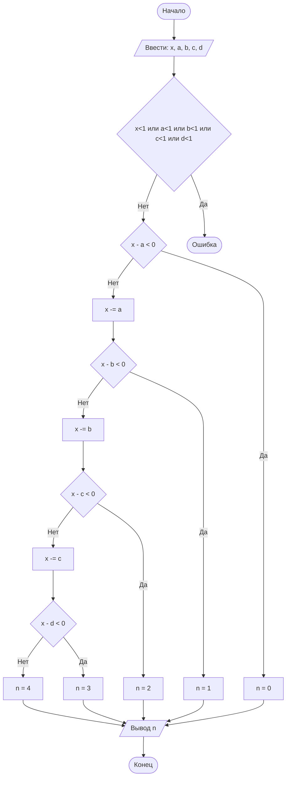

## Отчёт по лабораторной работе № 1

#### № группы: `ПМ-2501`

#### Выполнил: `Роднов Леонид Михайлович`

#### Вариант: `20`
---
### Содержание

- [1. Постановка задачи](#1-постановка-задачи)
- [2. Входные и выходные данные](#2-входные-и-выходные-данные)
- [3. Выбор структуры данных](#3-выбор-структуры-данных)
- [4. Алгоритм](#4-алгоритм)
- [5. Программа](#5-программа)
- [6. Анализ правильности решения](#6-анализ-правильности-решения)
---

### 1. Постановка задачи

- **Условие задачи**

>4 покупателя стоят в очереди за бананами. Они планируют купить A, B, C, D килограмм бананов соответственно порядку в
>очереди (или все оставшиеся, если к моменту обслуживания покупателя в магазине остаётся меньше бананов, чем планирует
>купить покупатель). Изначально в магазине имеется X кг бананов. Сколько покупателей смогут купить бананы, которые они
>планируют? На вход программы подаются натуральные числа X, A, B, C, D.

- Данная задача предполагает проверить сколько покупателей из четырёх купили ровно столько бананов, сколько они хотели, ибо
в условии сказано, что если бананов осталось меньше, чем планирует купить покупатель, то он скупает все оставшиеся, при
этом полностью не удовлетворяя свою потребность.

- Чтобы посчитать всех таковых покупателей, сначала надо решить задачу для одного их них. Рассмотрим следующий случай.
   - Пусть `X` кг бананов осталось перед обслуживанием покупателя, собирающегося купить `A` кг бананов. Мы будем учитывать
   этого покупателя только в том случае, если `X - A ⩾ 0`. И так далее для каждого покупателя. Если `X - A < 0`, то
   покупателя учитывать не будем, а дальнейшее рассмотрение бессмысленно.

### 2. Входные и выходные данные

#### **Данные на вход**

Согласно условию задачи на вход подаются 5 чисел `X, A, B, C, D`, принадлежащих множеству натуральных чисел `ℕ`. Верхняя
границы не задана, нижняя граница - `1`.

|Число|  Тип   |Нижняя граница|
|-----|--------|--------------|
|  X  |   ℕ    |      1       |
|  A  |   ℕ    |      1       |
|  B  |   ℕ    |      1       |
|  C  |   ℕ    |      1       |
|  D  |   ℕ    |      1       |

#### **Данные на выход**

Так как программа должна вывести количество покупателей, купивших столько бананов, сколько им нужно, то на выход мы получим
целое число `N ∈ ℤ`, такое что `0 ⩽ N ⩽ 4`

|Число|Тип|Нижняя граница|Верхняя граница|
|-----|---|--------------|---------------|
|  N  | ℤ |     0        |       4       |

### 3. Выбор структуры данных

Программа на вход получает 5 натуральных чисел, поэтому для их хранения достаточно выделить 5 переменных (`x, a, b, c, d`)
типа `int`.

|Число|Название переменной|Тип переменной|
|-----|-------------------|--------------|
|  X  |         x         |     int      |
|  A  |         a         |     int      |
|  B  |         b         |     int      |
|  C  |         c         |     int      |
|  D  |         d         |     int      |

Результат есть число целое `N`, причём настолько маленькое, что для него достаточно выделить всего 1 байт. Таким образом,
переменная `n` будет типа `byte`.

|Число|Название переменной|Тип переменной|
|-----|-------------------|--------------|
|  N  |        n          |    byte      |

### 4. Алгоритм

#### **Алгоритм выполнения программы**

1. Ввод данных:    
   Программа считывает 5 натуральных чисел `X, A, B, C, D`, переменные которых названы соотвественно `x, a, b, c, d`.

2. Проверка на ограничения:    
   Программа проверяет не является хотя бы одно число отрицательным или нулём. Если все числа больше нуля, программа
   продолжит алгоритм. В противном случае (меньше или равно нулю), программа завершится.

3. Сравнение разностей чисел:    
   - Программа сравнивает разность чисел `X` и `A` с нулём, то есть переменных `x` и `a` с нулём. Если разница меньше нуля,
   значит количество бананов в магазине недостаточно, чтобы полностью удовлетворить покупателя-1, тогда `n = 0`. В
   противном случае количество бананов достаточно, и покупатель-1 купил `A` кг бананов. Соответсвенно в магазине осталось
   `X - A` кг бананов, что соответсвует `x -= a`. Программа будет сравнивать разность `x` и `b` с нулём.
   - Если `x - b < 0`, то `n = 1`. В противном случае, `x -= b`, программа будет сравнивать разность `x` и `c` с нулём.
   - Если `x - c < 0`, то `n = 2`. Иначе, `x -= c`, и программа будет сравнивать `x - d` c нулём.
   - Если `x - d < 0`, то `n = 3`. Иначе `n = 4`, так как покупатель-4 последний.

4. Вывод результата:    
   Программа выводит результат в виде числа `N`, которому соответсувует переменная `n`.

#### **Блок-схема**




### 5. Программа

```java
import java.util.Scanner;
import java.io.PrintStream;

public class Main {
    // Объявляем объект класса PrinStream для вывода данных
    public static PrintStream out = System.out;
    // Объявляем объект класса Scanner для ввода данных
    public static Scanner in = new Scanner(System.in);

    public static void main(String[] args) {

        out.print("Укажите количество (кг) бананов, имеющихся в наличии в магазине: ");
        // Считывание целого числа x из консоли
        int x = in.nextInt();

        // Считвание целых чисел a, b, c, d из консоли
        out.println("Укажите в кг, сколько бананов хотят приобрести покупатели");
        out.print("Покупатель 1: ");
        int a = in.nextInt();
        out.print("Покупатель 2: ");
        int b = in.nextInt();
        out.print("Покупатель 3: ");
        int c = in.nextInt();
        out.print("Покупатель 4: ");
        int d = in.nextInt();

        // Условие натуральности чисел
        if (x < 1 || a < 1 || b < 1 || c < 1 || d < 1) {
            out.print("Ошибка: все числа должны быть натуральными");
            // Если хотя бы одно число не натуральное,
            // то преждевременно завершаем программу
            return;
        }

        // Объявляем переменную n типа byte
        byte n;

        // Проверка наличия бананов в магазине для покупателя-1
        if (x - a < 0)
            // Если бананов в магазине меньше, чем хочет купить покупатель-1,
            // то присваиваем n значение 0, дальнейшее рассмотрение остальных
            // покупателей бессмысленна, так как купля-продажа происходит в порядке очереди
            n = 0;
        else {
            // Если бананов достаточно, то покупатель-1 забирает из магазина a кг бананов,
            // и в магазине остаётся x - a бананов
            x -= a;

            // Проверка наличия бананов для покупателя-2
            if (x - b < 0)
                // Если бананов недостаточно, то к моменту обслуживания покупателя-2
                // магазин успел обслужить покупателя-1, поэтому n = 1
                n = 1;
            else {
                // Если бананов достаточно, в магазине останется x - b бананов
                x -= b;

                // Аналогичный алгоритм справедлив для покупателей 3 и 4
                if (x - c < 0)
                    n = 2;
                else {
                    x -= c;
                    if (x - d < 0)
                        n = 3;
                    else
                        n = 4;
                }
            }
        }

        // Вывод результата в консоль
        out.println("Всего " + n + " покупателей купили столько бананов, сколко планировали");
        out.print("Ответ: " + n);

    }
}
```

### 6. Анализ правильности решения  

Программа работает корректно для любых чисел, удовлетворяющих условию.

1. Тест для n = 0:  
    - Input:    
    ```
    5 6 1 1 1
    ```
    - Output:
    ```
    Ответ: 0
    ``` 
2. Тест для n = 1:
    - Input:    
    ```
    10 9 2 5 6
    ```
    - Output:
    ```
    Ответ: 1
    ``` 
3. Тест для n = 2:  
    - Input:    
    ```
    36 20 5 12 4
    ```
    - Output:
    ```
    Ответ: 2
    ``` 
4. Тест для n = 3:  
   - Input:    
    ```
    13 5 4 4 7
    ```
    - Output:
    ```
    Ответ: 3
    ``` 
5. Тест для n = 4:
   - Input:    
    ```
    127 4 7 8 11
    ```
    - Output:
    ```
    Ответ: 4
    ``` 
6. Тест на ограничения:
   - Input: 
    ```
    0 8 -1 5 8
    ```
    - Output:
    ```
    Ошибка: все числа должны быть натуральными
    ```
